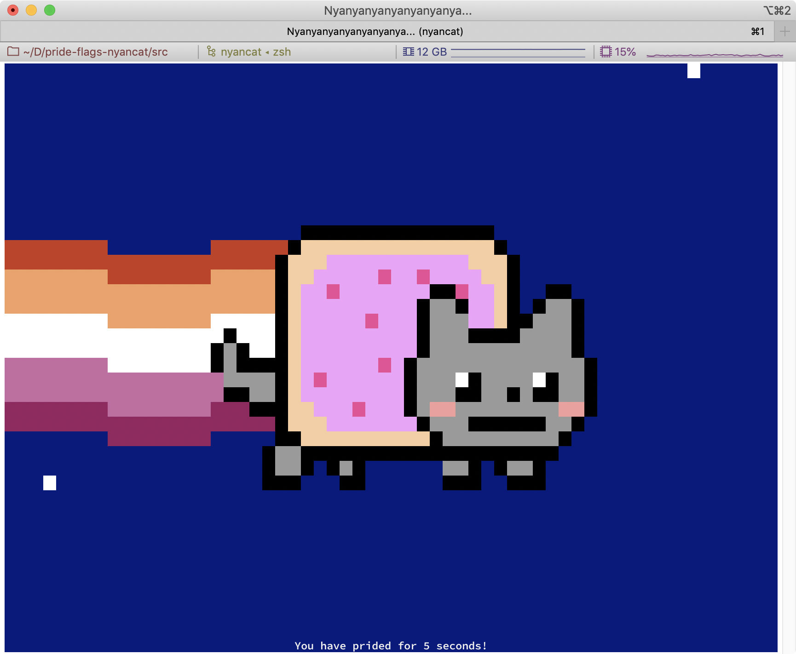
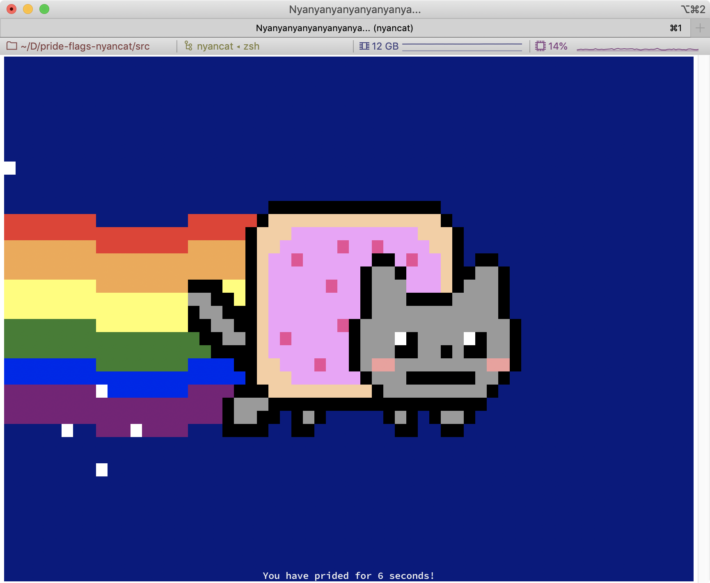
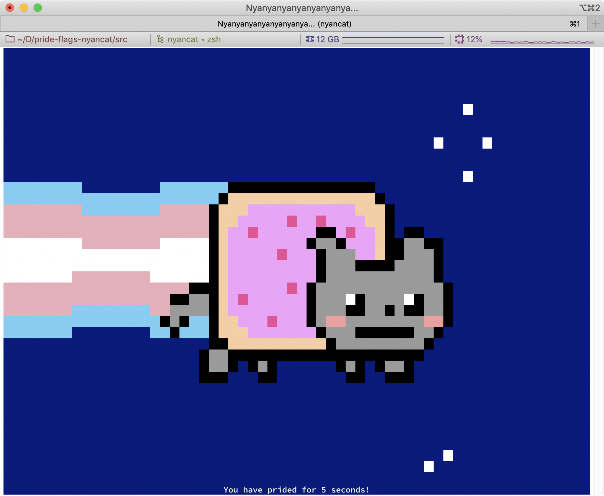
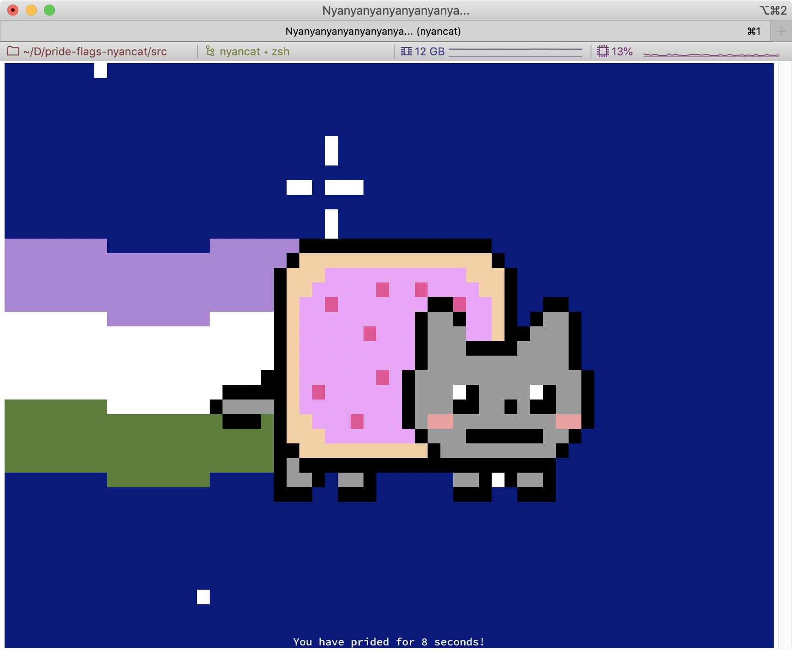
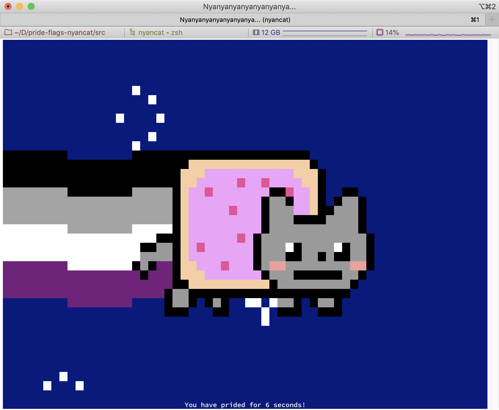
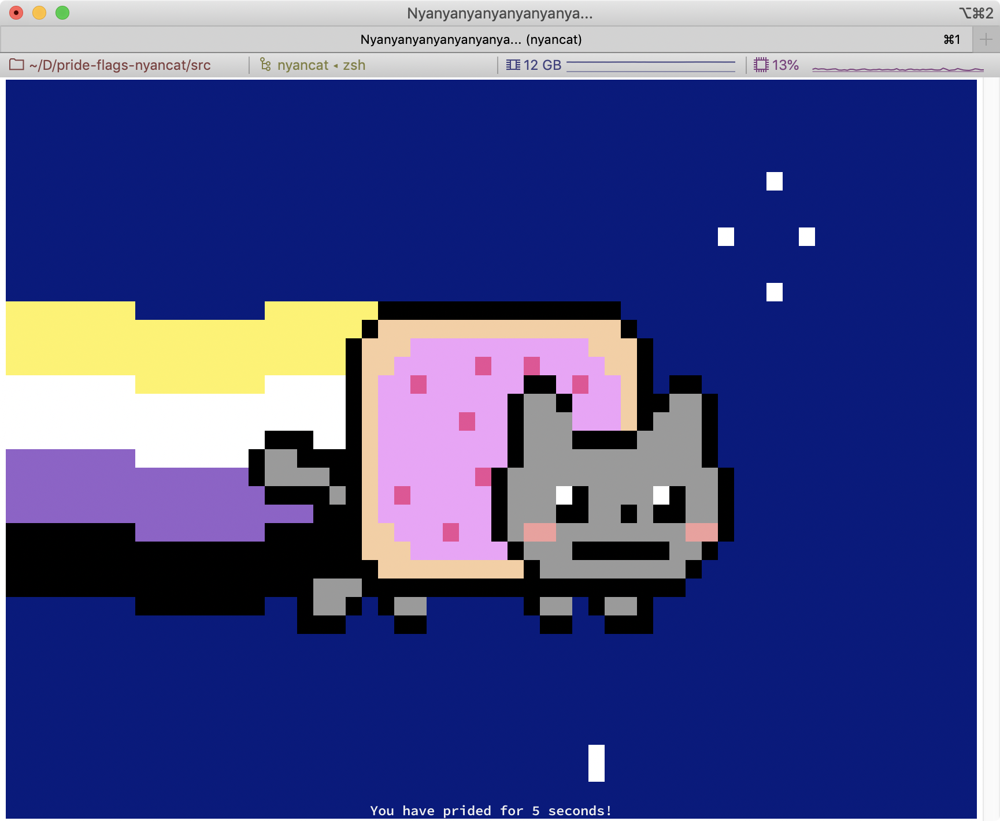
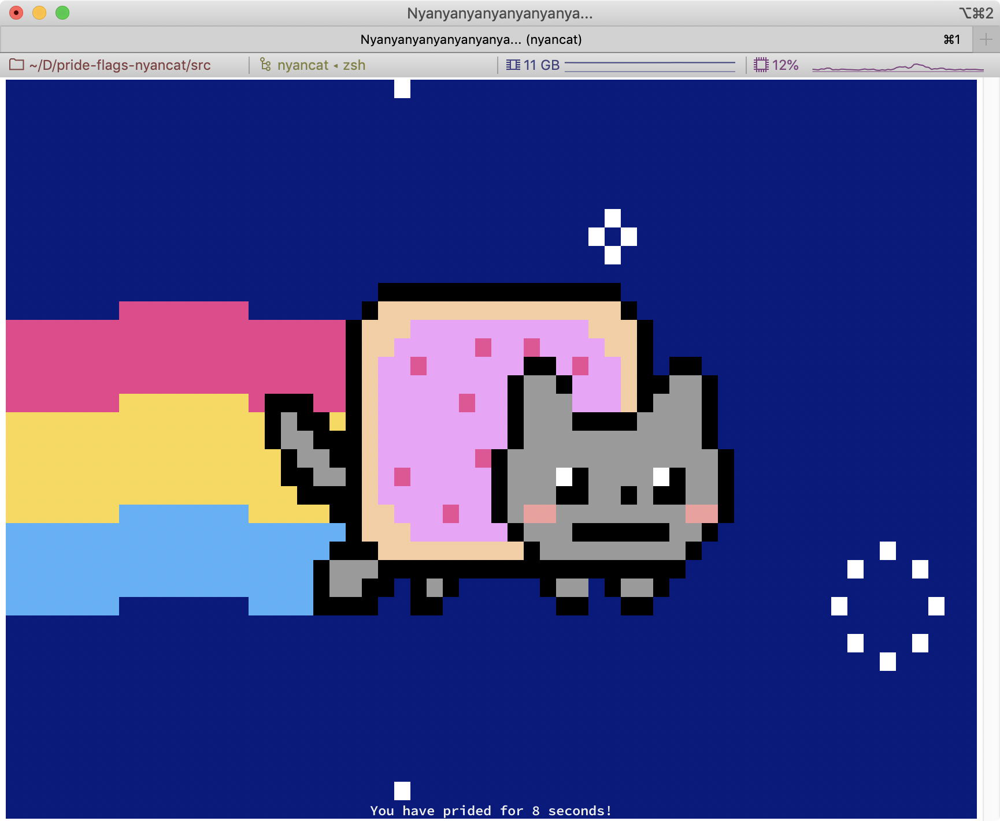

# Pride Flag Nyancat










This repository is a modified version of K. Lange's [terminal nyancat](https://github.com/klange/nyancat). 
As shown in the screenshots above, various pride flags, as well as terminal true color support have been added.
In addition, the support for `telnet` (and therefore `systemd`) has been dropped.
Due to the nature of the pride flags, support for legacy terminals have been dropped. To get an accurate reproduction
of the pride flags, a terminal emulator with 
[true color support](https://gist.github.com/XVilka/8346728#now-supporting-true-color) is recommended. At the bare
minimal, support for xterm-256 color is required. 

## Compilation

```bash
git clone https://github.com/mia1024/pride-flag-nyancat
cd pride-flag-nyancat
make 
```

## Usage

By default, the rainbow flag is displayed. To change the flag that is rendered, simply add
the first letter of the flag as a flag (pun intended) to the program.

The lesbian flag can be displayed with any of the following:
```bash
pride-nyancat -L
pride-nyancat --lesbian
pride-nyancat --pride lesbian
pride-nyancat --pride l
pride-nyancat -p lesbian
pride-nyancat -p l
```

The gay flag can be displayed with any of the following:
```bash
pride-nyancat
pride-nyancat -G
pride-nyancat --gay
pride-nyancat --pride gay
pride-nyancat --pride g
pride-nyancat -p gay
pride-nyancat -p g
```

The bisexual flag can be displayed with any of the following:
```bash
pride-nyancat -B
pride-nyancat --bisexual
pride-nyancat --pride bisexual
pride-nyancat --pride bi
pride-nyancat --pride b
pride-nyancat -p bisexual
pride-nyancat -p bi
pride-nyancat -p b
```

The transgender flag can be displayed with any of the following:
```bash
pride-nyancat -T
pride-nyancat --transgender
pride-nyancat --pride transgender
pride-nyancat --pride trans
pride-nyancat --pride t
pride-nyancat -p transgender
pride-nyancat -p trans
pride-nyancat -p t
```

The genderqueer flag can be displayed with any of the following:
```bash
pride-nyancat -Q
pride-nyancat --queer
pride-nyancat --pride queer
pride-nyancat --pride q
pride-nyancat -p queer
pride-nyancat -p q
```

The asexual flag can be displayed with any of the following:
```bash
pride-nyancat -A
pride-nyancat --asexual
pride-nyancat --pride asexual
pride-nyancat --pride ace
pride-nyancat --pride a
pride-nyancat -p asexual
pride-nyancat -p ace
pride-nyancat -p a
```

The pansexual flag can be displayed with any of the following:
```bash
pride-nyancat -P
pride-nyancat --pansexual
pride-nyancat --pride pansexual
pride-nyancat --pride pan
pride-nyancat --pride p
pride-nyancat -p pansexual
pride-nyancat -p pan
pride-nyancat -p p
```

The non-binary flag can be displayed with any of the following:
```bash
pride-nyancat -N
pride-nyancat --nonbinary
pride-nyancat --pride nonbinary
pride-nyancat --pride non-binary
pride-nyancat --pride nb
pride-nyancat -p nonbinary
pride-nyancat -p non-binary
pride-nyancat -p nb
```